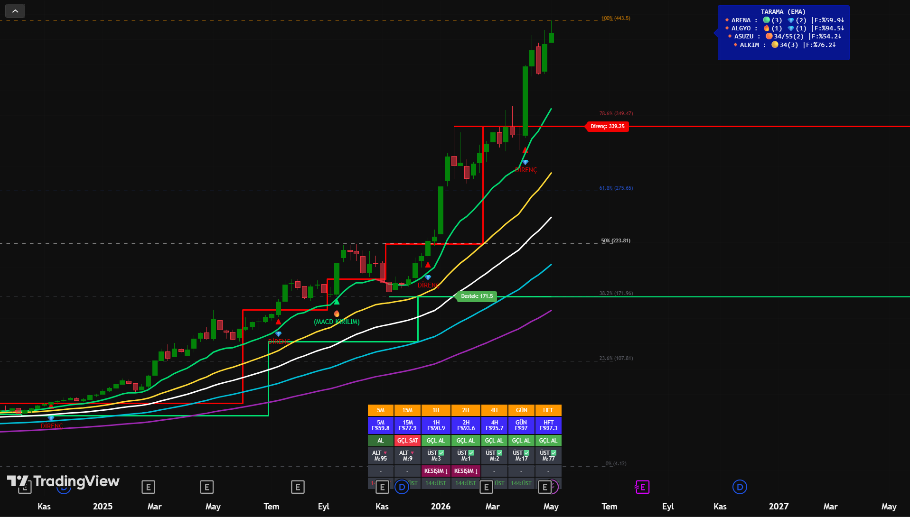
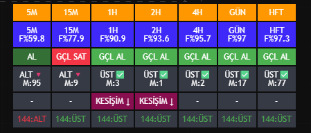
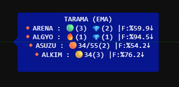

# Dinamik Kanal V2 (Dynamic Channel V2) - ARAL ÖMER ARSLAN

TradingView için Pine Script ile geliştirilmiş, yatırımcıların piyasa yönünü tayin etmesini kolaylaştıran kapsamlı bir teknik analiz ve hisse tarama (screener) indikatörüdür.

## 📖 Görsel Rehber: Grafik Çizgileri ve Paneller Ne Anlama Geliyor?

İndikatör grafiğe eklendiğinde birçok farklı veri noktasını tek ekranda sunar. Aşağıda grafikteki çizgilerin ve panellerin detaylı açıklamalarını bulabilirsiniz.

### 1. Ana Grafik Çizgileri ve Seviyeler

Grafik üzerinde yer alan hareketli ortalamalar ve yatay çizgiler, destek/direnç takibi için özel olarak renklendirilmiştir:

*   **Kalın Yeşil / Kırmızı Çizgi (Ana Trend):** 5, 8, 13, 21 ve 34 günlük hareketli ortalamaların birleşiminden oluşan ana trend çizgisidir. Fiyat bu çizginin üzerindeyse yeşil (yükseliş), altındaysa kırmızı (düşüş) yanar.
*   **Sarı Çizgi:** SMA 34 (34 Günlük Basit Hareketli Ortalama)
*   **Beyaz Çizgi:** SMA 55 (55 Günlük Basit Hareketli Ortalama)
*   **Turkuaz (Açık Mavi) Çizgi:** SMA 89 (89 Günlük Basit Hareketli Ortalama)
*   **Mor Çizgi:** SMA 144 (144 Günlük Basit Hareketli Ortalama - Uzun Vade Trend)
*   **Düz Kırmızı / Yeşil Yatay Çizgiler:** Algoritmanın otomatik tespit ettiği dinamik **Direnç (Kırmızı)** ve **Destek (Yeşil)** noktalarıdır.
*   **Kesik Yatay Çizgiler:** Belirlenen periyottaki en yüksek ve en düşük seviyelere göre otomatik çizilen **Fibonacci düzeltme seviyeleridir** (Örn: %38.2, %50, %61.8).

---

### 2. Çoklu Zaman Dilimi (MTF) Tablosu

Ekranın alt orta kısmında yer alan bu tablo, hissenin 5 dakikalıktan (5M) Haftalık (HFT) periyoda kadar olan genel röntgenini çeker.

*   **F% Değeri:** Fiyatın, son 200 mumluk periyottaki en dip ve en tepe noktasına göre nerede olduğunu yüzdelik olarak gösterir. (Örn: F%97 ise fiyat son dönemin en zirvelerindedir).
*   **Durum (AL / GÇL AL / SAT):** SuperTrend ve EMA21 verilerine göre o zaman dilimindeki ana yönü belirtir.
*   **ALT / ÜST (M: Sayı):** Fiyatın son direncini kırıp kırmadığını gösterir. "M:" değeri, bu kırılımın üzerinden kaç mum geçtiğini belirtir.
*   **KESİŞİM (MACD):** O zaman diliminde MACD indikatöründe yakın zamanda bir aşağı veya yukarı kesişim olup olmadığını gösterir.
*   **144 Durumu:** Fiyatın o periyotta SMA144'ün altında mı yoksa üstünde mi olduğunu belirtir.

---

### 3. Otomatik Tarama (Radar) Paneli

Ekranın sağ üst köşesinde yer alan bu panel, seçtiğiniz hisse grubunu (Örn: Yıldız Pazar, Ana Pazar) arka planda tarar ve sinyal üretenleri listeler.

*   Sembollerin yanındaki sayılar (Örn: `(3)`), o sinyalin üzerinden **kaç mum geçtiğini** ifade eder.
*   **🚀 (Güçlü Al):** Güçlü trend kesişimlerini ifade eder.
*   **💎 (Direnç):** Hissenin önemli bir direnci yeni kırdığını gösterir.
*   **🔥 / 🟢 / 🔵 / 🟡 (Kombo Sinyaller):** WaveTrend, MACD ve Trend algoritmasının aynı anda olumlu sinyal verdiği hisseleri belirtir.
*   **⚪ (Kesişim):** Fiyatın önemli SMA seviyelerini (örneğin SMA34 veya SMA55) yukarı kestiğini gösterir.

## 🚀 Temel Özellikler
*(Bu kısımdan sonrasına önceki mesajda verdiğim özellikler ve kurulum adımları listesini ekleyebilirsin.)*

